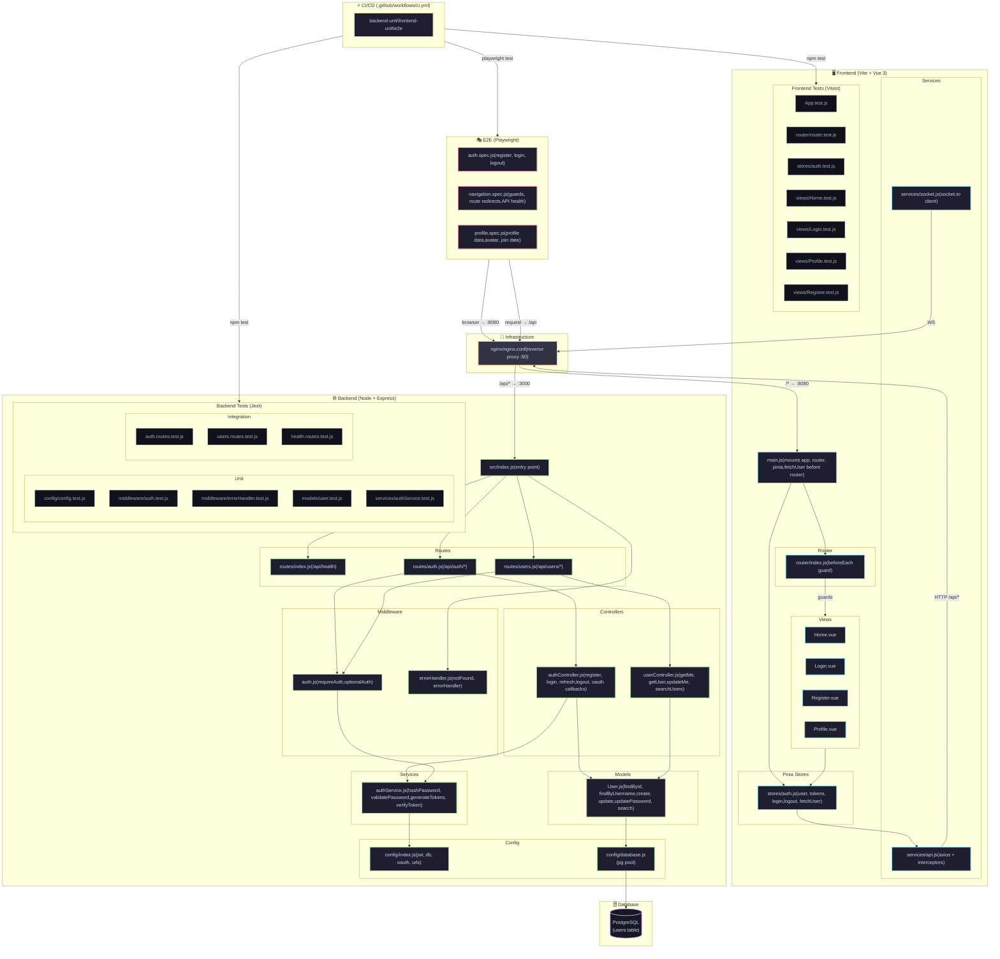

# Cleanscendence

> 42 Transcendence — Vue 3 + Express.js + PostgreSQL + Docker + nginx + Socket.io + Three.js

## Team

| Dev | Areas |
|-----|-------|
| **ValGSgit** | Product Owner · Docker · Makefile · .env · Auth · API · PostgreSQL |
| **DavidPoetsch** | nginx · Backend · PostgreSQL |
| **fankahou** | Frontend · Game Core · 3D Graphics |
| **LukasStefanek** | Frontend · Game Core · 3D Graphics |

## Quick Start

```bash
# 1. Clone & copy env
cp .env.example .env          # edit passwords / secrets

# 2a. Docker (recommended)
make build && make up          # http://localhost:8080

# 2b. Local dev (without Docker)
make install && make dev       # frontend :5173, backend :3000
```


---

## Architecture — System Overview



## Architecture — Request Lifecycle

```
.
├── backend/          Express.js API server
│   └── src/
│       ├── config/       Config & DB connection
│       ├── controllers/  Route handlers
│       ├── middleware/    Auth, error handling
│       ├── models/       Data access
│       ├── routes/       API routes
│       ├── services/     Business logic
│       └── utils/        Helpers
├── frontend/         Vue 3 + Vite SPA
│   └── src/
│       ├── components/   Reusable UI
│       ├── router/       Vue Router
│       ├── services/     API & Socket clients
│       ├── stores/       Pinia stores
│       └── views/        Page components
├── nginx/            Reverse proxy config
├── PostgreSQL/       DB init scripts
├── shared/           Shared game logic (Three.js)
├── docker-compose.yml
├── Makefile
└── .env.example
```

## Services (Docker)

| Service | Container | Port |
|---------|-----------|------|
| nginx | cleanscendence_nginx | **8080** → 80 |
| frontend | cleanscendence_frontend | 5173 |
| backend | cleanscendence_backend | 3000 |
| postgres | cleanscendence_db | 5432 |

## Issue Tracker

See [GitHub Issues](https://github.com/ValGSgit/Cleanscendence/issues) for the full backlog.

