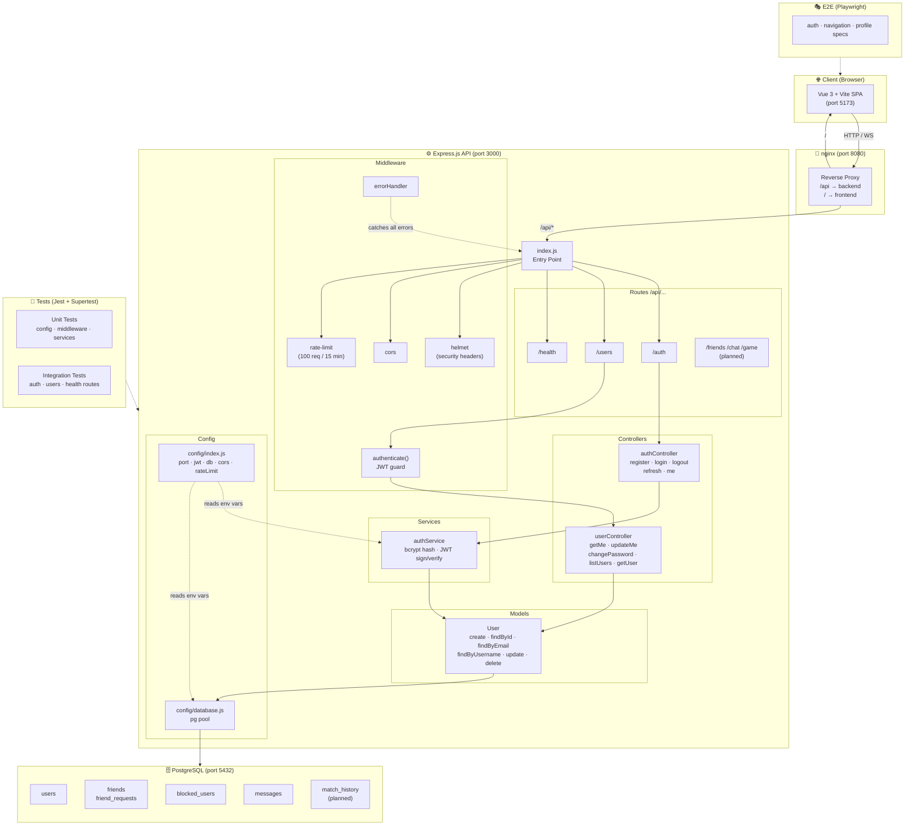

# Cleanscendence

> 42 Transcendence — Vue 3 + Express.js + PostgreSQL + Docker + nginx + Socket.io + Three.js

## Team

| Dev | Areas |
|-----|-------|
| **ValGSgit** | Product Owner · Docker · Makefile · .env · Auth · API · PostgreSQL |
| **DavidPoetsch** | nginx · Backend · PostgreSQL |
| **fankahou** | Frontend · Game Core · 3D Graphics |
| **LukasStefanek** | Frontend · Game Core · 3D Graphics |

## Quick Start

```bash
# 1. Clone & copy env
cp .env.example .env          # edit passwords / secrets

# 2a. Docker (recommended)
make build && make up          # http://localhost:8080

# 2b. Local dev (without Docker)
make install && make dev       # frontend :5173, backend :3000
```


---

## Architecture — System Overview



## Architecture — Request Lifecycle

```
Browser / Client
      │
      ▼
  nginx :8080
      │  /api/*
      ▼
  index.js
      │
      ├─► helmet (security headers)
      ├─► cors
      ├─► express-rate-limit  (100 req / 15 min per IP)
      ├─► express.json body parser
      │
      ├─► /api/health  ────────────────────────────► 200 OK
      │
      ├─► /api/auth/*
      │       └─► authController
      │                └─► authService  (bcrypt / JWT)
      │                        └─► User model  (pg pool)
      │                                └─► PostgreSQL
      │
      └─► /api/users/*
              └─► authenticate()  ← JWT guard
                      └─► userController
                               └─► User model  (pg pool)
                                       └─► PostgreSQL
```

---

## Services (Docker)

| Service | Container | Port |
|---------|-----------|------|
| nginx | cleanscendence_nginx | **8080** → 80 |
| frontend | cleanscendence_frontend | 5173 |
| backend | cleanscendence_backend | 3000 |
| postgres | cleanscendence_db | 5432 |

## Issue Tracker

See [GitHub Issues](https://github.com/ValGSgit/Cleanscendence/issues) for the full backlog.
