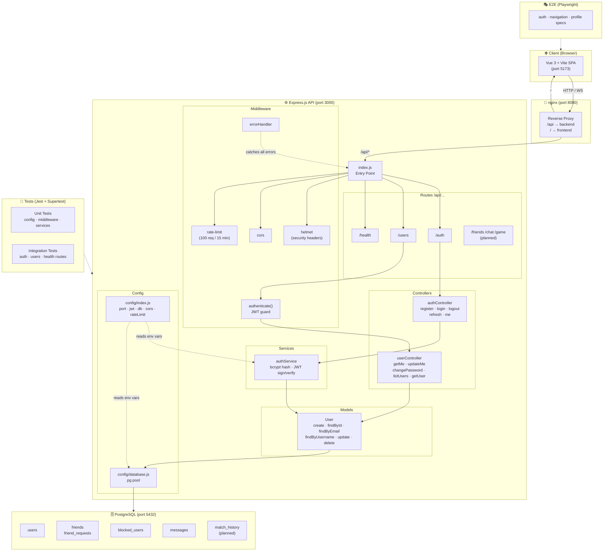

# AlpacaParty — Backend

> Express.js REST API for the AlpacaParty project (42 Transcendence).  
> Owners: **ValGSgit** · **DavidPoetsch**

---

## Tech Stack

| Layer | Technology |
|-------|-----------|
| Runtime | Node.js (ESM) |
| Framework | Express.js 4 |
| Database | PostgreSQL 16 via `pg` pool |
| Auth | JWT (access + refresh tokens) · bcrypt |
| Security | helmet · cors · express-rate-limit |
| Real-time | Socket.io *(wired, not yet initialised)* |
| Testing | Jest · Supertest |

---

## Folder Structure

```
backend/
├── src/
│   ├── index.js              # Entry point — middlewares, routes, http server
│   ├── config/
│   │   ├── index.js          # Centralised env-var config (jwt, db, cors, rate-limit)
│   │   └── database.js       # pg connection pool
│   ├── controllers/
│   │   ├── authController.js # register, login, logout, refresh, me
│   │   └── userController.js # getMe, updateMe, changePassword, listUsers, getUser
│   ├── middleware/
│   │   ├── auth.js           # authenticate() / optionalAuth() JWT guards
│   │   └── errorHandler.js   # 404 catcher + global error handler
│   ├── models/
│   │   └── User.js           # Data-access layer (SQL queries, no ORM)
│   ├── routes/
│   │   ├── index.js          # Mounts all sub-routers under /api
│   │   ├── auth.js           # /api/auth/*
│   │   └── users.js          # /api/users/* (all protected)
│   ├── services/
│   │   └── authService.js    # hashPassword, comparePassword, generateAccessToken, generateRefreshToken, verifyToken
│   └── utils/                # (placeholder — helpers go here)
└── tests/
    ├── setup.js
    ├── helpers/
    │   └── createApp.js      # Test app factory (no listen)
    ├── integration/
    │   ├── auth.routes.test.js
    │   ├── health.routes.test.js
    │   └── users.routes.test.js
    └── unit/
        ├── config/config.test.js
        ├── middleware/auth.test.js
        ├── middleware/errorHandler.test.js
        └── services/authService.test.js
```

---

## API Reference

### Base URL
```
Docker:    http://localhost:8080/api
Local dev: http://localhost:3000/api
```

### Health
| Method | Endpoint | Auth | Description |
|--------|----------|------|-------------|
| GET | `/health` | — | Server liveness check |

### Auth — `/api/auth`
| Method | Endpoint | Auth | Description |
|--------|----------|------|-------------|
| POST | `/register` | — | Create account (username, email, password) |
| POST | `/login` | — | Return access + refresh tokens |
| POST | `/logout` | Bearer | Invalidate session |
| POST | `/refresh` | — | Exchange refresh token for new access token |
| GET | `/me` | Bearer | Return current user profile |

### Users — `/api/users` *(all routes require Bearer token)*
| Method | Endpoint | Description |
|--------|----------|-------------|
| GET | `/me` | Get own profile |
| PUT | `/me` | Update own profile (username, bio, avatar, status) |
| PUT | `/me/password` | Change password |
| GET | `/` | List all users |
| GET | `/:id` | Get user by ID |

### Planned routes *(not yet implemented)*
```
/api/friends        Friend requests & friend list
/api/chat           Real-time chat (Socket.io)
/api/game           Match-making & game state
/api/notifications  In-app notifications
```

---

## Request / Response format

**Auth header (protected routes)**
```
Authorization: Bearer <access_token>
```

**Error response envelope**
```json
{
  "error": {
    "message": "Human-readable description",
    "stack": "..."          // development only
  }
}
```

---

## Environment Variables

Copy `.env.example` from the project root and fill in the values.

| Variable | Default | Description |
|----------|---------|-------------|
| `PORT` | `3000` | Express listen port |
| `NODE_ENV` | `development` | `development` \| `production` |
| `JWT_SECRET` | *(random in dev)* | **Required in production** |
| `JWT_EXPIRES_IN` | `24h` | Access token lifetime |
| `JWT_REFRESH_EXPIRES_IN` | `7d` | Refresh token lifetime |
| `DB_HOST` | `localhost` | PostgreSQL host |
| `DB_PORT` | `5432` | PostgreSQL port |
| `DB_NAME` | `alpacaparty` | Database name |
| `DB_USER` | `alpacaparty` | Database user |
| `DB_PASSWORD` | `alpacaparty` | Database password |
| `CORS_ORIGINS` | `http://localhost:5173,http://localhost:8080` | Comma-separated allowed origins |

---

## Running Locally

**With Docker (recommended)**
```bash
# From project root
make build && make up
# Backend available at http://localhost:8080/api
```

**Without Docker**
```bash
cd backend
npm install
npm run dev        # node --watch (no extra tooling needed)
```

---

## Testing

```bash
cd backend

# Run all tests with coverage
npm test

# Watch mode during development
npm run test:watch
```

Tests use **Jest** + **Supertest**.  
Integration tests spin up an in-process Express app (no Docker needed).  
Coverage is collected for `src/**`.

---

## Architecture — System Overview



## Architecture — Request Lifecycle

```
Browser / Client
      │
      ▼
  nginx :8080
      │  /api/*
      ▼
  index.js
      │
      ├─► helmet (security headers)
      ├─► cors
      ├─► express-rate-limit  (100 req / 15 min per IP)
      ├─► express.json body parser
      │
      ├─► /api/health  ────────────────────────────► 200 OK
      │
      ├─► /api/auth/*
      │       └─► authController
      │                └─► authService  (bcrypt / JWT)
      │                        └─► User model  (pg pool)
      │                                └─► PostgreSQL
      │
      └─► /api/users/*
              └─► authenticate()  ← JWT guard
                      └─► userController
                               └─► User model  (pg pool)
                                       └─► PostgreSQL
```

---

## Database Tables

| Table | Purpose |
|-------|---------|
| `users` | Core user accounts |
| `friend_requests` | Pending / accepted / declined friend requests |
| `friends` | Confirmed friend pairs |
| `blocked_users` | Block list |
| `messages` | Chat messages |
| `match_history` | Game match records *(planned)* |

See [`PostgreSQL/init.sql`](../PostgreSQL/init.sql) for full schema.

---

## What's Next

- [ ] Socket.io initialisation (`services/socketService.js`)
- [ ] OAuth / 42 login (Passport.js — Issue #8)
- [ ] `/api/friends` route module
- [ ] `/api/chat` route module (Socket.io events)
- [ ] `/api/game` route module (match-making)
- [ ] 2FA (TOTP, `two_factor_secret` column already in DB)
